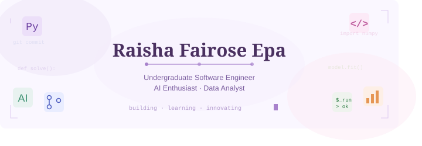

  

I’m a passionate learner with strong interests in technology, cybersecurity, programming, and machine learning. I enjoy exploring how systems work, solving technical problems, and building practical projects such as smart parking solutions using AI and computer vision. Alongside my technical journey, I focus on improving my academic and professional skills through continuous learning and certifications like the ECBA. I’m detail-oriented, curious, and always motivated to turn ideas into real-world solutions while growing both personally and professionally. 

## Socials:
     

# Tech Stack:
                     
# GitHub Stats:
 
 

## GitHub Trophies

### ✍️ Random Dev Quote

<!-- Proudly created with GPRM ( https://gprm.itsvg.in ) -->
